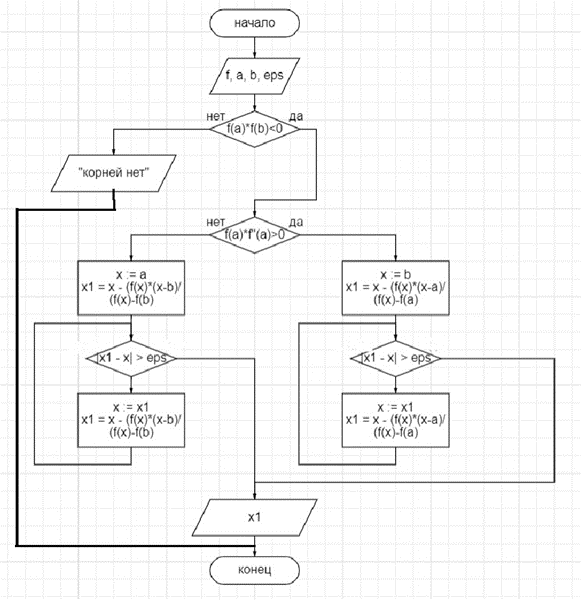
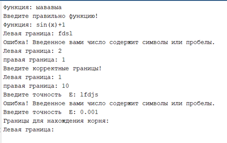
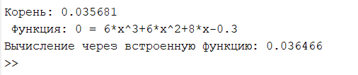
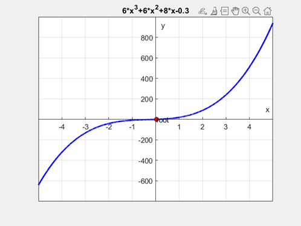
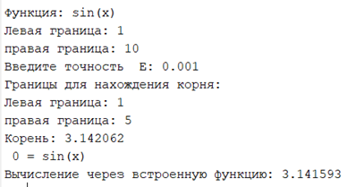
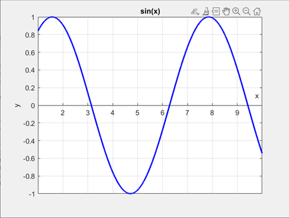
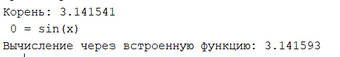

# Chord method MATLAB
Solving a nonlinear equation by the chord method. An analytical method is used to separate the roots.

---
## Оглавление
* <a href="#1">Описание метода численной реализации задания</a>
* <a href="#2">__Описание ручного счета тестового примера предложенным м етодом__</a>	
* <a href="#3">__Разработка алгоритмов решения задачи__</a>	
* <a href="#4">__Проверка корректности ввода__</a>
* <a href="#5">__Результат работы программы__</a>
* <a href="#6">__Результат реализации метода с помощью встроенных функций__</a>

---

## <a id="1">Описание метода численной реализации</a>	 

При решении нелинейного уравнения методом хорд, помимо функции $f(x)$, задаются интервал $[a,b]$, на котором существует только одно решение, и точность $ε$. При условии, что $f(a) * f(b) < 0$, отрезок $[a,b]$ разбивается на 2 отрезка с помощью хорды, происходит выбор нового отрезка от точки пересечения хорды с осью абсцисс до неподвижной точи, на которой функция меняет знак и содержит решение, причём подвижная точка приближается к $ε$-окрестности решения.

<a id="form1">Формула для вычисления точки пересечения хорды с осью X:</a>
$$a - \frac{f(a) * (a - b)} {f(a) - f(b)}(1)$$

Критерий выбора неподвижной точки (выбора нового отрезка): проводим фиксацию точки с сохранением свойства, что на концах этого отрезка функция имеет разный знак. Поиск решения прекращается при достижении заданной точности $|f(c)|<ε$.

## <a id="2">Описание ручного счета тестового примера предложенным методом</a>	
Для ручного счета было дано уравнение:
$$6t^3+6t^2+8t-0.3=0$$
Чтобы узнать, есть ли у этого уравнения хотя бы один корень, подставим вместо $t$ значения -5 и 5:
$$f(-5)= -640.3;  f(5)=939.7$$
$$f(-5)*f(5)<0$$
В интервале $[-5;5]$ есть хотя бы один корень. Нашли производную данного уравнения:
$$f'(t)=18t^2+12t+8=0$$
Вычислили корни производной, перед этим разделили все уравнение на 18 для удобства подсчета:
$$t^2+\frac{2}{3}t+\frac{4}{9}=0$$
$$D=(\frac{2}{3})^2-\frac{16}{9}=-\frac{4}{3}<0$$
Дискриминант меньше нуля, значит производная уравнения больше нуля, тогда корень будет единственный на всей области определения. 

Далее по формуле <a href="#form1">(1)</a> производились расчеты для поиска корня уравнения, приближение 1:
$$t_0=-5-\frac{(-640.3)*(-5-5)}{-640.3-939.7}=-0.98$$
$$f(t_0 )=-8.02, f (t_0 )*f(b_0 )<0$$
Тогда $a_1=-0.98,b_1=5$

Приближение 2:
$$t_1=-0.98-\frac{(-8.02)*(-0.98-5)}{-8.02-939.7}=-0.92$$
$$f(t_1 )=-7.25,f(t_1 )*f(b_1 )<0$$

Тогда $a_2=-0.92,b_2=5$

Приближение 3:
$$t_2=-0.92-\frac{(-7.25)*(-0.92-5)}{-7.25-939.7}=-0.87$$
$$f(t_2 )=-6.67,f (t_2 )*f(b_2 )<0$$

Тогда $a_3=-0.87,b_1=5$

Приближение 4:
$$t_3=-0.87-\frac{(-6.67)*(-0.87-5)}{-6.67-939.7}=-0.83$$
$$f(t_3 )=-6.24,(t_3 )*f(b_3 )<0$$

Тогда $a_4=-0.83,b_4=5$

Таким образом корень уравнения $t = -0.83$ с точностью $0.04$.

## <a id="3">Разработка алгоритмов решения задачи</a>	
Для данного алгоритма понадобятся входные данные, а именно:
- Функция
- Левая граница и правая границы
- Точность

Алгоритм решения нелинейного уравнения методом хорд:

 Рисунок 1

## <a id="4">Проверка корректности ввода</a>

В этой программе пользователь должен вводить свои значения, которые затем проверяются на соответствие заданным критериям. Входные данные должны быть правильно введены, включая корректность функции, корректность границ и правильное соотношение между нижней и верхней границами. Кроме того, все введенные значения должны быть числами. Проверка показана на рисунке 2.

 Рисунок 2

## <a id="5">Результат работы программы</a>

На рисунке 3 представлен результат работы демоверсии программы.

 Рисунок 3

На рисунке 4 представлен график построенной функции. 

 Рисунок 4

На рисунке 5 результат работы программы с возможностью пользовательского ввода. 

 Рисунок 5

На рисунке 6 представлен график функции для программы с пользовательским вводом.

 Рисунок 6

## <a id="6">Результат реализации метода с помощью встроенных функций</a>

В Matlab для вычисления корней нелинейных уравнений существует функция «fzero». Результат работы программы совпадает с результатом работы встроенной функции Matlab. Результат показан на рисунке 7.

 Рисунок 7
